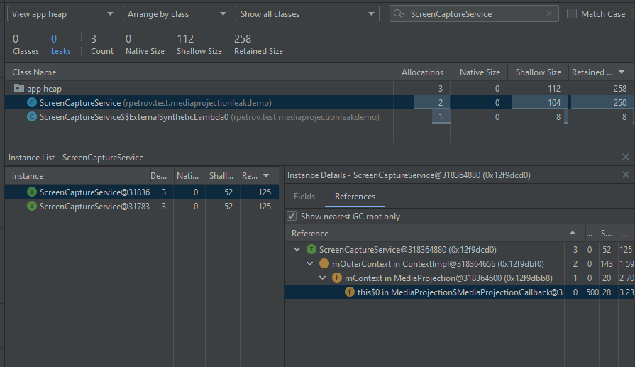

This applicatoin demonstrate memory leak in Android MediaProjection

*Environment*
| Software | Version |
| ----------- | ----------- |
| Android Studio   | Build #AI-213.7172.25.2113.9123335, built on September 30, 2022  |
|Runtime version   |11.0.13+0-b1751.21-8125866 amd64   |
|VM   |OpenJDK 64-Bit Server VM by JetBrains s.r.o.  |


*Application setup*

```
plugins {
    id 'com.android.application' version '7.1.2' apply false
    id 'com.android.library' version '7.1.2' apply false
    id 'org.jetbrains.kotlin.android' version '1.6.10' apply false
}
```

*dependencies*
```
    debugImplementation 'com.squareup.leakcanary:leakcanary-android:2.12'
    implementation 'com.google.android.material:material:1.5.0'
    implementation 'androidx.constraintlayout:constraintlayout:2.1.3'
    testImplementation 'junit:junit:4.13.2'
    androidTestImplementation 'androidx.test.ext:junit:1.1.3'
    androidTestImplementation 'androidx.test.espresso:espresso-core:3.4.0'
```

*How to reproduce*

Follow this manual: https://developer.android.com/guide/topics/large-screens/media-projection

At first make request permission:
```
    startActivityForResult(
        mediaProjectionManager.createScreenCaptureIntent(),
        REQUEST_CODE
    )
```
See [MainActivity](https://github.com/RPetrov/MediaProjectionLeakDemo/blob/main/app/src/main/java/rpetrov/test/mediaprojectionleakdemo/MainActivity.kt)

At second setup MediaProjection:
```
    mediaProjection = mediaProjectionManager.getMediaProjection(
        intent.getIntExtra("RESULT_CODE", 0),
        intent.getParcelableExtra<Intent>("DATA")!!
    )
```

See [ScreenCaptureService](https://github.com/RPetrov/MediaProjectionLeakDemo/blob/main/app/src/main/java/rpetrov/test/mediaprojectionleakdemo/ScreenCaptureService.kt)


You can just clone application and start/stop MediaProjection

*Where is the memory leak*

**Leak Canary**

There is Leak Canary trace:

```
    References underlined with "~~~" are likely causes.
    Learn more at https://squ.re/leaks.
    
    625 bytes retained by leaking objects
    Displaying only 1 leak trace out of 5 with the same signature
    Signature: a986e3ada7a0f3d1cc20672fc5b8f41b2c2189be
    ┬───
    │ GC Root: Global variable in native code
    │
    ├─ android.media.projection.MediaProjection$MediaProjectionCallback instance
    │    Leaking: UNKNOWN
    │    Retaining 3.2 kB in 27 objects
    │    ↓ MediaProjection$MediaProjectionCallback.this$0
    │                                              ~~~~~~
    ├─ android.media.projection.MediaProjection instance
    │    Leaking: UNKNOWN
    │    Retaining 2.7 kB in 26 objects
    │    mContext instance of android.app.ContextImpl
    │    ↓ MediaProjection.mContext
    │                      ~~~~~~~~
    ├─ android.app.ContextImpl instance
    │    Leaking: UNKNOWN
    │    Retaining 1.6 kB in 20 objects
    │    mOuterContext instance of rpetrov.test.mediaprojectionleakdemo.ScreenCaptureService
    │    ContextImpl.mOuterContext is an instance of rpetrov.test.mediaprojectionleakdemo.ScreenCaptureService
    │    ↓ ContextImpl.mOuterContext
    │                  ~~~~~~~~~~~~~
    ╰→ rpetrov.test.mediaprojectionleakdemo.ScreenCaptureService instance
    ​     Leaking: YES (ObjectWatcher was watching this because rpetrov.test.mediaprojectionleakdemo.ScreenCaptureService
    ​     received Service#onDestroy() callback and Service not held by ActivityThread)
    ​     Retaining 125 B in 2 objects
    ​     key = 68f51a96-1353-4155-b47b-4c9adeee759e
    ​     watchDurationMillis = 5904
    ​     retainedDurationMillis = 900
    ​     mApplication instance of android.app.Application
    ​     mBase instance of android.app.ContextImpl
```


leak: MediaProjectionCallback -> MediaProjection -> context

MediaProjectionManager creates MediaProjection with context:

```
public MediaProjection getMediaProjection(int resultCode, @NonNull Intent resultData) {
        if (resultCode != Activity.RESULT_OK || resultData == null) {
            return null;
        }
        IBinder projection = resultData.getIBinderExtra(EXTRA_MEDIA_PROJECTION);
        if (projection == null) {
            return null;
        }
        return new MediaProjection(mContext, IMediaProjection.Stub.asInterface(projection));
    }
```

MediaProjection creates MediaProjectionCallback:

```
public MediaProjection(Context context, IMediaProjection impl) {
        mCallbacks = new ArrayMap<Callback, CallbackRecord>();
        mContext = context;
        mImpl = impl;
        try {
            mImpl.start(new MediaProjectionCallback());
        } catch (RemoteException e) {
            throw new RuntimeException("Failed to start media projection", e);
        }
    }
```

MediaProjectionCallback holds MediaProjection, MediaProjection holds context:
